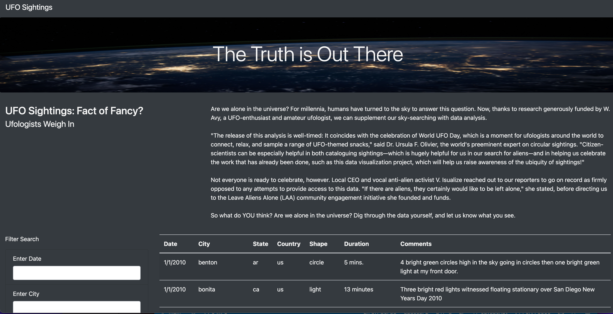
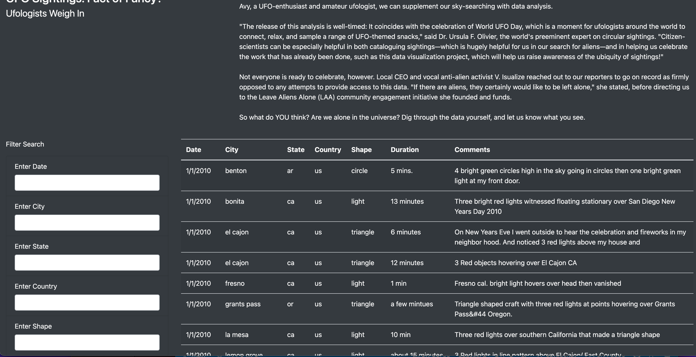
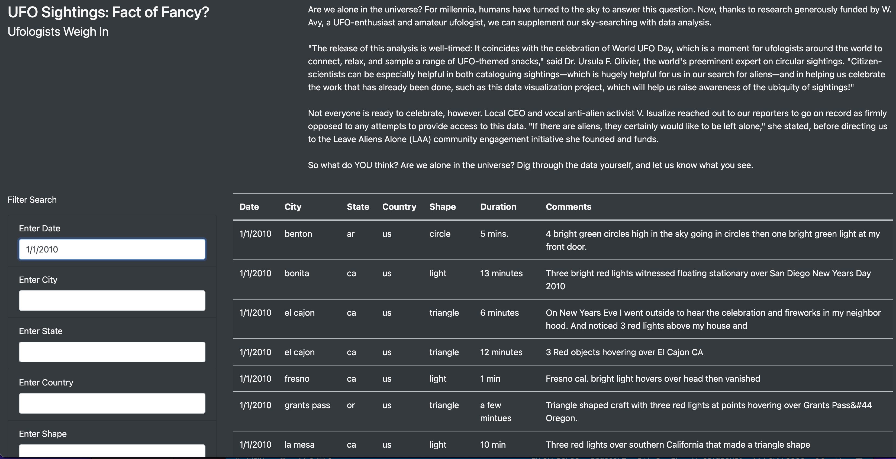
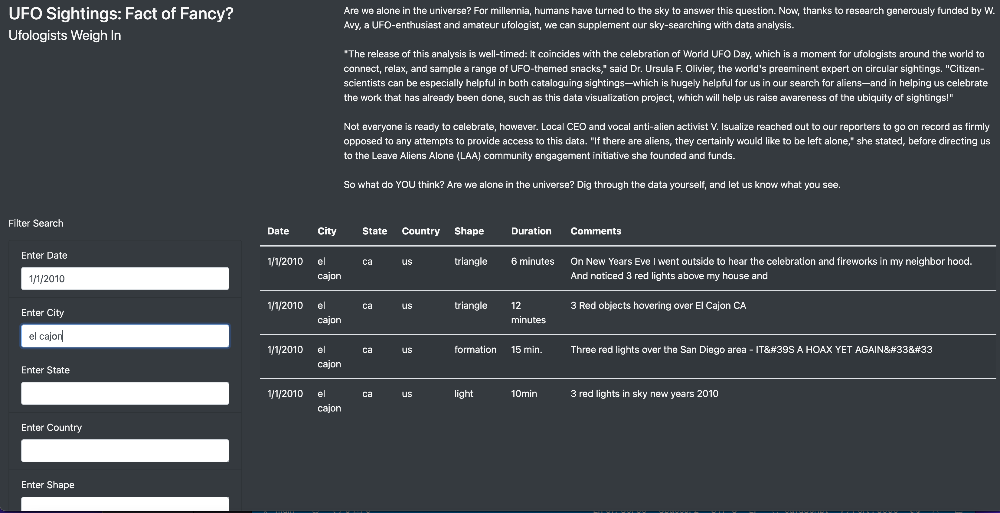
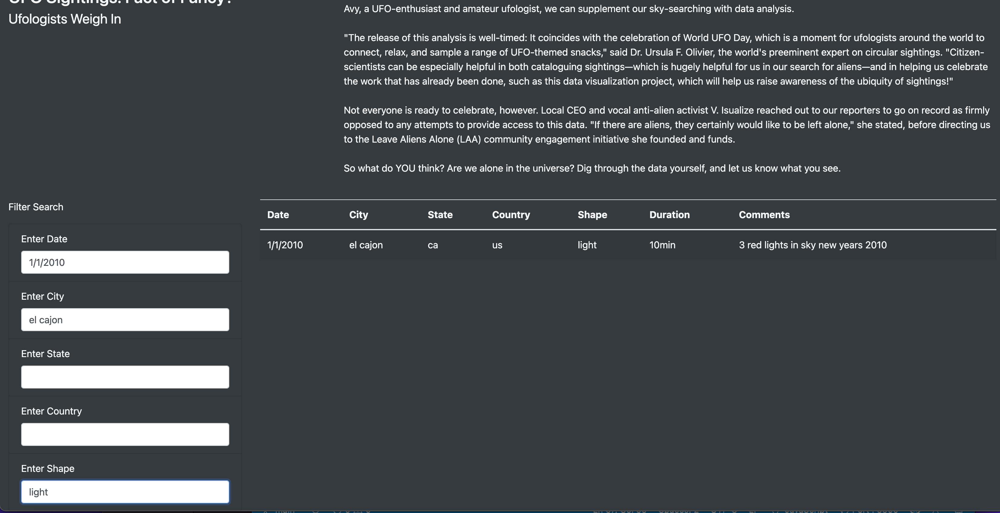

# UFO Sightings

## Overview

### Initial approach

Data journalist Dana ventured to explore an eccentric writing assignment that brought her back to her hometown in Mississippi.  The topic - UFO Sightings - had attracted the attention of foreigners to her native land. Captivated by curiosity that dated back from her childhood, she decided to indulge her now-established reputation as a data journalist, and she took on the assignment.

Dana's research into records of UFO sightings returned a compilation of entries that included the date, exact location, shape, duration, and even specific comments on each sighting from cities across the US. The format, JavaScript, seemed conducive of an idea for a small project: to build an html page; one that could include her article, along with the data she found, all in accessible, interactive visual formats.

With this new project in mind, she approached us for our help in building an easy-to-use webpage taking advantage of the seamless visual functionality that JavaScript can offer.

### Programmatic Execution

Using Visual Studio Code we created an html file that contained code for the placement of the elements and their display on the page and links to their functional parts. Using d3, Bootstrap and a css stylesheet, we crafted a visually appealing portal. Dana wrote her article, which we also included in the portal.

Aware of the versatility and  functionality of JavaScript, Dana wanted to create filters as a way to allow the user to conduct searches and manipulate the data interactively. 

Still in Visual Studio, we created a JavaScript file where we provided code for populating the data in the table of contents, and on which had code for the various interactive aspects of the webpage. 

We initially included an input field and a search/filter button that would enable the user to input a date and filter the table according to that date, visualizing the corresponding list of sightings.

Afterwards, we fulfilled Dana's later request to refine the filtering facilities for manipulating tabular data on the web portal, with the creation of code for multiple input fields, each corresponding to a particular criteria, that could be used to narrow down a search based on one or more criteria, and to visualize one or more entries as lists extracted from the original table.

## Results

### UFO Sightings Webpage

We created a folder containing our html file, and another, 'static' folder within it. The 'static' folder contained the JavaScript and CSS files that compose the multiple pieces of the puzzle that would run concomitantly to produce a cohesive,  functional, visual and interactive project. 

When all the pieces were properly crafted and weaved together, we launched the code from the index.html on a browser. 

This is a snapshot of our portal on a Chrome browser:

### Using Search Criteria

#### Initial Table Visualization

Scrolling down, we can see the table that is automatically populated as the portal is launched, as well as the 'Filter Search' tab on the left with empty input fields for respective filter criteria:

#### Narrowing Down

By typing a date in the 'Enter Date' field, we narrow down the entries to include every entry that was made on a specific date:

By typing a city in the 'Enter City' field, maintaining the previous criteria, we narrow down the results to include all the entries that were made on that specific date from this particular city :

By typing the name o a sighted UFO shape in the corresponding field, 'Shape', further below, and maintaining to the previous criteria, we can narrow down the results to one entry:

## Summary

The web portal that we created is effective and visually appealing, and combines all of the elements that were mapped out in the blueprint that we created when brainstorming with Dana.

The first design of the webpage, with input field and search button, offered the possibility of filtering using one criteria only - date. The new design, in turn, amplifies the possibilities by adding a few more input fields corresponding to additional criteria. By combining various criteria, the user can achieve the visualization of different arrays and combinations on display.

One salient drawback of the new design is its cluttered visual presentation, and along with it a search system that is not as inviting or intuitive as a search/filter button can be.

For further development of the webpage, here are some ideas and suggestions that we would like to offer:

- Revert the initial visual presentation to a single input field. 
- This input field would:
  - Include a brief explanatory text with directions above it.
  - Have the ability to take input from any criteria.
    - After the first input and first return, a new page would appear where the 'filter search' tab would then have additional search fields corresponding to specific criteria, for refinement of the search. 
    - For fields with categorical selections, a drop-down menu corresponding to each item in every criteria would be available in every search field which would make the selection process more intuitive and easier to navigate. (Instead of typing in text and pressing 'Enter')
    - For fields with with larger amounts of text, provide an empty text field to type in, where key words can be captured.
- Every input field in the webpage should be programmed to take and process inputs that are not exact (i.e. - spelling, syntax, capitalizations, various date formats, key words).
- Also include, underneath this singular initial input field, a link to the page with specific criteria fields - in case the user wanted to initiate their search by applying filters based on certain criteria.

- In order to collect user feedback and potentially gather contributions to tabular data, a link to a survey/contact form can be included.
